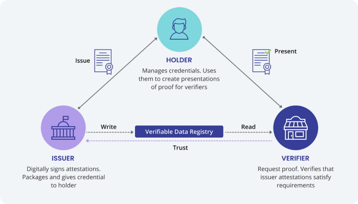

# Blockchain World Passport - Self Sovereign Passport -

# Umut Yorulmaz - 101410083

# REQUIREMENTS:

# PROBLEM STATEMENT: 

There are 3 main problems with the centrally issued passports. First, authenticity; these paper passports what we have today can be easily faked which can cause safety issues for the countries visited by the fake passport holder. 

Second, privacy; when we asked to provide the passport, many times we give out more information than necessary to the verifier. For instance, in order to book a plane ticket, the vendor just needs to know if we have a valid passport and if we require a visa or not. However, since currently there is no other way like zero knowledge proofs we have to provide whole passport with out sensitive information written on it. Moreover, trusting a central authority (governemnt database) to keep personal information is not a secure practice. There have been many hacks happened so far, targetting government databases. Hackers stole sensitive data of the citizens. 

Third, physical paper passports can be damaged or stolen and issuing a new one takes a good amount of time.     

# GOALS: 

There are 3 goals of the project:
First, reaching 100% authenticity by the help of verifiable credentials (a set of encrypted data can be verified instantly). 

Second, improved privacy by using zero-knowledge proofs (A zero-knowledge proof is a cryptographic method where an entity can prove to another entity that they know a certain value without disclosing the actual value). In the above vendor-traveller example lets say the traveller has his/her passport as VC (verifiable credential), in that case the traveller doesnt need to reveal all passport details to the vendor, s/he can just prove that it is possible for her/him to travel to the destination country. Moreover, by introducing decentralization (more nodes better the security is) to the database keeping, sensitive data will be secured efficiently without relying only 1 database. 

Third, recovering lost or stolen wallet / mobile device or computer (where SSP - self sovereign passport - is hold ) is instant. No need to visit embassy (if there is any) and wait for a long time. However, it must be kept in mind that in order to recover the SSP, seed (recovery) phrase, can be 12 or 24 words, is necessary and the only way. So, before switching to digital idendity concept, strong education about ownership and the basics of the digital wallets is required. 

# STAKEHOLDERS: 

Issuer, Holder, Verifier, Verifiable Data Registry (A role a system might perform by mediating the creation and verification of identifiers, keys, and other relevant data, such as verifiable credential schemas, revocation registries, issuer public keys, and so on, which might be required to use verifiable credentials) . Roles can be changed according to the different scenarios. For example, lets take a look at border control. Holder will be the individual, the traveller, the passport holder. Verifier will be the country border official at the pasport control. Issuer will be the home country of the traveller. Verifiable Data Registry will be decentralized database and as proposed in this project IPFS (Interplanetary File System) can be used. The relationship in between interacting parties can be seen by the trust triangle below.
 

  

# RESTRICTIONS / RULES: 

Users, Artists and Developers will have different rights to interact with the platform. In order to make this happen we will implement role based access control design patterns on the block chain side and we will develop different user interfaces for each on the front end side. There will be rules to use platforms to keep the environment harassment free and to make sure everyone respects the property rights of others. Rules and regulations will be kept to minimum in order to support freedom of speech and creation, and avoid censorship.

# DEPENDENCIES: 

Brew
NPM
Indy-sdk

# ARCHITECTURE:

ABSTRACT / TOP LEVEL DESCRIPTION: A platform on block chain that mimics a service like Spotify or Apple Music. The logic will have a user deposit a subscription fee and then be able to interact (play music) from an artist (or many). Each iteration is counted and after a given time the subscription fee is paid out in proportion to how many interactions the user has had with each artist. The more interactions mean a larger cut of the subscription payout.

PROJECT DESCRIPTION: We are creating a block chain music streamer for users/consumers, artists and developers. Which enables listeners to listen to music or podcasts on the platform by paying a monthly subscription fee. Moreover, the platform allows artists to publish their songs and get rewards per listen and their music can influence and be used by other artists to a certain level(%100 copying the content is not allowed to respect property rights). Artists and content creators must pay a monthly subscription fee as well. In addition to it, the platform will welcome and encourage developers to maintain and update the platform. Code will be open-source. Developers will be rewarded by the revenue created in the platform. Design patterns are explained throughout the document to be implemented to different parts of the project such as; different permissions to different stakeholders,data management, security.  
PROJECT WORKFLOW:

# PROJECT WORKFLOW

FUNCTIONS:

INPUTS / OUTPUTS

addArtist

Takes an address, stores it in an array

INPUT: Address type
OUTPUT: Array index position

Deposit

Takes value and holds it in the contract

INPUT: Uint type
OUTPUT: Value stored

distributeFunds

Pays out value from contract

INPUT: interactions mapping
OUTPUT: pay out through for-loop

incrementArtist

Add to the artist interactions

INPUT: Address type
OUTPUT: Address => uint256 mapping

artistInteractions

View artist interactions

INPUT: address type
OUTPUT: uint type

getContractBalance

View balance in smart contract

INPUT: View / call
OUTPUT: Uint type

totalInteractions

View total amount of interactions

INPUT: View / call
OUTPUT: Uint type

TECH STACK: In order to develop this project we will use; Solidity to write the smart contract, React and JavaScript to develop the front-end user interface, Node.js and Express to develop the back-end. We will use Metamask and Goerli test net to test the project. And Remix will be used to test and write Smart contracts.

DATA: Data will be handled by using design patterns such as; encrypting on-chain data, tokenization, and off-chain storage. Encryption on-chain data and off-chain storage will be used to create and store the hash value of the MP3, which will be stored originally off-chain to keep the block chain execution fees minimum. Use of applications such as IPFS would assist with this. User subscription and music data will be implemented to the project at further development stages.

# VIDEO DEMOSTRATION

https://drive.google.com/file/d/1mddaZO6OjBLZjvvNi_u5INbKaVU1U0Vh/view?usp=share_link
