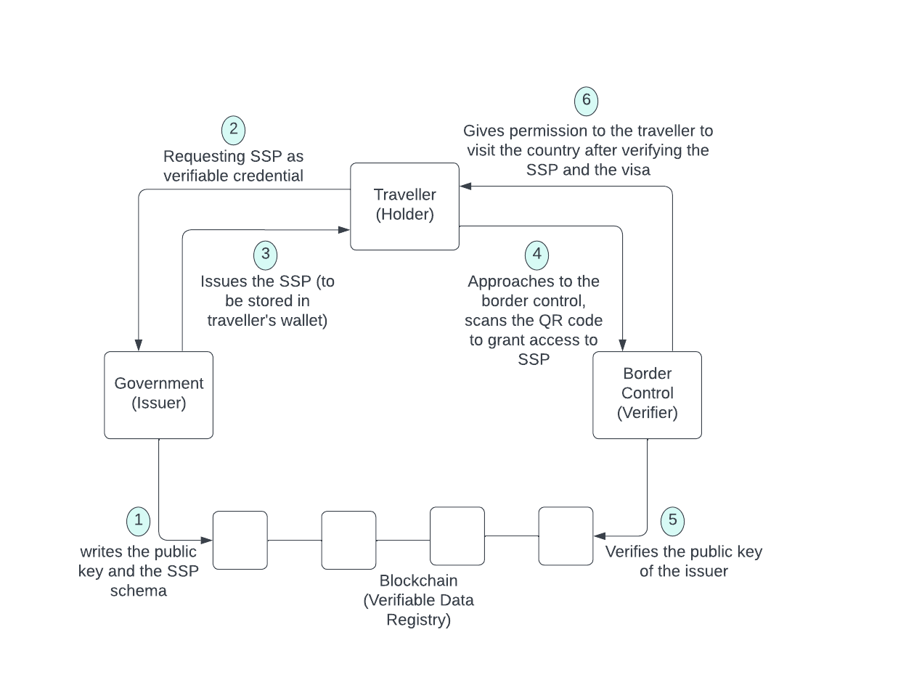

# Blockchain World Passport - Self Sovereign Passport -

# Umut Yorulmaz - 101410083

# REQUIREMENTS:

# PROBLEM STATEMENT: 

There are 3 main problems with the centrally issued passports. First, authenticity; these paper passports what we have today can be easily faked which can cause safety issues for the countries visited by the fake passport holder. 

Second, privacy; when we asked to provide the passport, many times we give out more information than necessary to the verifier. For instance, in order to book a plane ticket, the vendor just needs to know if we have a valid passport and if we require a visa or not. However, since currently there is no other way like zero knowledge proofs we have to provide whole passport with out sensitive information written on it. 

Third, it is difficult to process a traditional paper passport online especially for serious tasks such as grant permission to pass the border.

# GOALS: 

There are 3 goals of the project:

First, reaching 100% authenticity by the help of verifiable credentials (a set of encrypted data about an entity can be verified instantly). 

Second, improved privacy by using zero-knowledge proofs (A zero-knowledge proof is a cryptographic method where an entity can prove to another entity that they know a certain value without disclosing the actual value). In the above vendor-traveller example lets say the traveller has his/her passport as VC (verifiable credential), in that case the traveller doesnt need to reveal all passport details to the vendor, s/he can just prove that it is possible for her/him to travel to the destination country.

Third, enabling online operations empowered by verifiable credentials. 

# GLOSSARY:

Verifiable Credential (VC): can hold all of the same information that a physical credential holds. For example; a photo, name, ID number, a health insurance card, passport, Canadian driving licence, natonality, expiration date, issuer etc. It can be verified instantly. Contains DIDs of the issuer and the holder.
 

  

Decentralized Identifier (DID): they are new type of “identifiers” or addresses which can be queried to return some information about the subject represented. Traditional identifiers; driving licence, SIN number etc. DID enables verifiable, decentralized digital identity. A DID refers to any subject (e.g., a person, organization, thing, data model, abstract entity, etc.) as determined by the controller of the DID. A DID is a simple text string and it has three parts: 1 -> the did URI scheme identifier, 2 -> the identifier for the DID method, and 3 -> the DID method-specific identifier. Decentralized Identifiers are a component of larger systems, such as the Verifiable Credentials ecosystem.
 

  

DID Architecture:
 

  

DID controllers: is the entity (person, organization, or autonomous software) that has the capability—as defined by a DID method—to make changes to a DID document.

DID documents: is returned when they are queried contain some cryptographic key material and, depending on the particularities of the returning system, maybe a few other pieces of information or addresses, public keys.

DID methods: DID methods are the mechanism by which a particular type of DID and its associated DID document are created, resolved, updated, and deactivated.

DIDComm (DID Communications): is a set of tools to allow horizontal (or at least, power-neutral) and bidirectional channels of communication between two entities that know each other’s DIDs and nothing else.

Pairwise DID: A DID intended to be known by its subject and exactly one other party.

Zero Knowledge Proof (ZKP): Zero Knowledge Proof is a concept of cryptography where a
presenter presents the proof to verifier without revealing the actual data itself. It is a well developed concept defined using cryptographic algorithms. ZKP algorithms are coded in Hyperledger Indy and they are used in the presentation of proof.
 

  

Trust over internet protocol (ToIP): It is a set of standards developed by Trust over IP Foundation to establish the protocols required for setting up SSI.
 

  

Verifiable Data Registry (blockchain): It is the backbone of the trust triangle and the SSI system, it is a blockchain and necessary to have one in order to;

1- store the public keys of the issuer to be used to sign the related verifiable credential 
2- store the schema to set the standards about how credentials will look like
3- store the revocation list (containing expired or cancelled identifiers of the VCs) and DID documents

Moreover, we need a blockchain to introduce a source of decentralized trust and make the ledger public so anyone in the ecosystem can read this data. 

# STAKEHOLDERS: 

Issuer, Holder, Verifier, Verifiable Data Registry (A role a system might perform by mediating the creation and verification of identifiers, keys, and other relevant data, such as verifiable credential schemas, revocation registries, issuer public keys, and so on, which might be required to use verifiable credentials) . Roles can be changed according to the different scenarios. For example, lets take a look at border control. Holder will be the individual, the traveller, the passport holder. Verifier will be the country border official at the pasport control. Issuer will be the home country of the traveller. Verifiable Data Registry will be decentralized database and as proposed in this project IPFS (Interplanetary File System) can be used. No personal data is kept on the blockchain, it only stores DID documents and public keys. When verifier needs to verify to see if the holder has a valid VC, it pulls the public key of the issuer from the verifiable data registry (blockchain) and can verify that the VC is issued by the issuer and valid. The relationship in between interacting parties can be seen by the trust triangle below.
 

  

# RESTRICTIONS / RULES: 

Issuer, Holder, Verifier, Verifiable Data Registry will have different rights to interact with the platform. In order to make this happen, role based access control design patterns will be implemented on the block chain side. It should be kept in mind that, depends on the scenario roles can be interchanged. For example, holder can be a verifier, in case of the traveller asking the airline company to prove that they are a legit company. Or Verifier can be an issuer, in case of airline company giving out the boarding pass to the passenger.  

There will be different user interfaces for each party on the front end side.

This application is designed to be used in a valid subset (environment) where the variables and intervals are determined. For example, governments of the different countries should come together and agree on to develop set of rules and protocols based on a mutual agreement to approve and implement this system at their borders to make the world travel efficient, secure and easy. Based on the rules and protocols determined by the govermnents SSP application will be developed further to follow the related code of conduct.

Holders are responsible for wallet utilization in order to store their verifiable credential. It can be any compatible web3 wallet. There will be no third party to recover any lost verifiable credential which can cause great difficulty to the holder. In order to prevent this, it is strongly suggested that the holder must be aware of the responsibility must have his/her recovery phrase all the time with her/him at somewhere secure but easy to reach.

 
# DEPENDENCIES: 

Brew 
NPM 
Indy-sdk

# ARCHITECTURE:

**ABSTRACT / TOP LEVEL DESCRIPTION:** SSP (self sovereign passport) is a subset of SSI (self sovereing identity), a model aiming to enable world travel safer, easier, more secure by using the power of decentralization, verifiable credentials and dids (decentralizaed identifiers) based on ToIP (trust over internet protocol).

**PROJECT DESCRIPTION:** I am creating SSP (self sovereign passport application) for the people who interacts with a passport such as; holder / traveller, government (border control), transportation industry  (airline  or bus companies), hotels. Compared with the current paper passports, self sovereign digital passport offers higher security, privacy, authenticity. It uses verifiable credentials, decentralized identifiers, decentralized storage / databases, zero knowledge proofs and web3 wallets to run. It is powered by Hyperledger Indy public permissioned blockchain. The standards are set by ToIP (Trust over Internet Protocol).

**HOW IT WORKS:** Let's imagine a traveller approaching a border control; based on a request to see the validity of passport from the border official, traveller (holder) will open its digital wallet (where the SSP is stored). The verifiable credential, issued by the home country government of the traveller, will be in a form of QR code and traveller will get it scanned by the machine provided by the border control. Upon scanning the QR code there will be a channel created in between border control official (verifier) and the traveller (holder) by DIDComm (decentralized identifier communication). Parties will identify each other using DIDs (decentralized identifiers) only, they dont need to know more about each other. Mutual authentication is provided by cryptography assures the security of the channel (which is huge benefit, didnt exist before SSI introduced). Then thorough the channel the traveller can present its VC and the proof to the verifier. Based on a trust in between verifier and the issuer which is set by the international mutual agreement ..   

# PROJECT WORKFLOW

 

    

# TECH STACK: 

Coding language: JavaScript  
Blockchain: Hyperledger Indy  
Protocols: Hyperledger Aries, ToIP (Trust Over Internet Protocol) 
Runtime environment: Node.js 
Software framework: React Native

# DATA: 

Veriable data registry (IPFS) is where the data is stored. Based on their roles, each party can interact with it. Issuer is allowed to write to the registry, on the other hand verifier can only read from registry. Once issuer issues the credentials to the holder, holder will store its crendentials metadata in its wallet to be presented to the verifier when it is asked. Please see the visual under stakeholders section to understand the roles better. 

No private data is written on the blockchain, only public data is there.

**What is on blockchain:**

Public DIDs and DID DOCs 
Issuer's Public Keys 
Credentials Schema 
Revocation List

**What is NOT on blockchain:** 

Pairwise DIDs 
Credentials 
Proves 
Private Keys  

# VIDEO DEMONSTRATION:

# REFERENCES:

https://www.w3.org/TR/vc-data-model/#what-is-a-verifiable-credential
https://www.w3.org/TR/did-core/
https://northernblock.io/
https://learnmeabitcoin.com/technical/ecdsa
https://aries.js.org/
https://medium.com/decentralized-identity/understanding-didcomm-14da547ca36b 
https://www.hyperledger.org/
